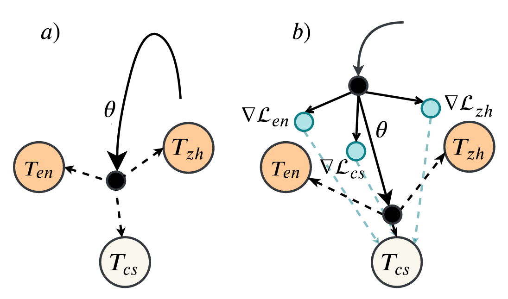

## Meta-Transfer Learning for Code-Switched Speech Recognition
### Genta Indra Winata, Samuel Cahyawijaya, Zhaojiang Lin, Zihan Liu, Peng Xu, Pascale Fung

 [](https://opensource.org/licenses/MIT) 

This is the implementation of our paper accepted in [ACL](https://www.aclweb.org/anthology/2020.acl-main.348/) 2020.

This code has been written using PyTorch. If you use any source codes or datasets included in this toolkit in your work, please cite the following papers.
```
@inproceedings{winata-etal-2020-meta,
    title = "Meta-Transfer Learning for Code-Switched Speech Recognition",
    author = "Winata, Genta Indra  and
      Cahyawijaya, Samuel  and
      Lin, Zhaojiang  and
      Liu, Zihan  and
      Xu, Peng  and
      Fung, Pascale",
    booktitle = "Proceedings of the 58th Annual Meeting of the Association for Computational Linguistics",
    month = jul,
    year = "2020",
    address = "Online",
    publisher = "Association for Computational Linguistics",
    url = "https://www.aclweb.org/anthology/2020.acl-main.348",
    pages = "3770--3776",
}
```

## Abstract
An increasing number of people in the world today speak a mixed-language as a result of being multilingual. However, building a speech recognition system for code-switching remains difficult due to the availability of limited resources and the expense and significant effort required to collect mixed-language data. We therefore propose a new learning method, meta-transfer learning, to transfer learn on a code-switched speech recognition system in a low-resource setting by judiciously extracting information from high-resource monolingual datasets. Our model learns to recognize individual languages, and transfer them so as to better recognize mixed-language speech by conditioning the optimization on the code-switching data. Based on experimental results, our model outperforms existing baselines on speech recognition and language modeling tasks, and is faster to converge.

## Data
- SEAME Phase II datasets (https://catalog.ldc.upenn.edu/LDC2015S04)
- HKUST (https://catalog.ldc.upenn.edu/LDC2005S15)
- CommonVoice v3 (Nov 2019)
Kindly check the /data/ directory to check the data split and labels.

## Model Architecture


## Setup
- Install PyTorch (Tested in PyTorch 1.0 and Python 3.6)
- Install library dependencies (requirement.txt)

## Run the code
- Meta-Transfer Learning
```
python meta_transfer_train.py --train-manifest-list data/manifests/cv-valid-train_manifest.csv data/manifests/hkust_16khz_train_manifest.csv data/manifests/seame_phaseII_train_manifest.csv \
--train-partition-list 1 1 1 --valid-manifest-list data/manifests/cv-valid-dev_manifest.csv data/manifests/hkust_16khz_dev_manifest.csv data/manifests/seame_phaseII_val_manifest.csv \ 
--name mtl_enc2_dec4_512_b8_16khz_copy_grad --cuda --k-train 8 --k-valid 8 --labels-path data/labels/hkust_seame_labels.json --lr 1e-4 --save-folder save/ --save-every 10000 \ 
--feat_extractor vgg_cnn --dropout 0.1 --num-enc-layers 2 --num-dec-layers 4 --num-heads 8 --dim-model 512 --dim-key 64 --dim-value 64 --dim-input 5120 --dim-inner 512 --dim-emb 512 --early-stop cer,200 \
--src-max-len 5000 --tgt-max-len 2500 --evaluate-every 10000 --epochs 1000000 --sample-rate 16000 --copy-grad
```

- Joint training
```
python joint_train.py --train-manifest-list data/manifests/cv-valid-train_manifest.csv data/manifests/hkust_16khz_train_manifest.csv data/manifests/seame_phaseII_train_manifest.csv \
--valid-manifest-list data/manifests/cv-valid-dev_manifest.csv data/manifests/hkust_16khz_dev_manifest.csv data/manifests/seame_phaseII_val_manifest.csv --cuda --k-train 8 \
--labels-path data/labels/hkust_seame_labels.json --lr 1e-4 --name joint_enc2_dec4_512_b8_16khz --save-folder save/ --save-every 10000 --feat_extractor vgg_cnn --dropout 0.1 --num-enc-layers 2 \
--num-dec-layers 4 --num-heads 8 --dim-model 512 --dim-key 64 --dim-value 64 --dim-input 5120 --dim-inner 512 --dim-emb 512 --early-stop cer,200 --src-max-len 5000 --tgt-max-len 2500 --evaluate-every 10000 \
--epochs 10000000 --sample-rate 16000 --train-partition-list 1 1 1
```

## Bug Report
Feel free to create an issue or send email to giwinata@connect.ust.hk
